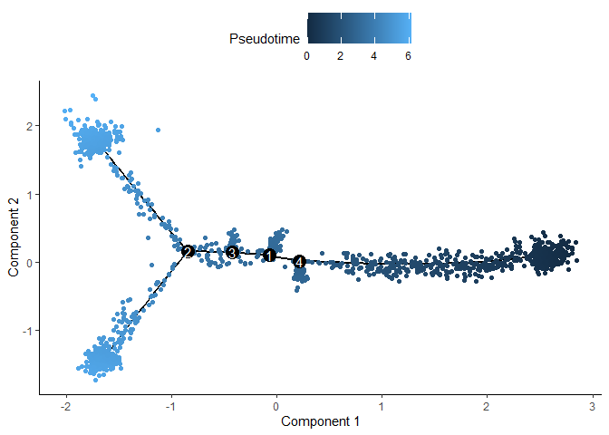
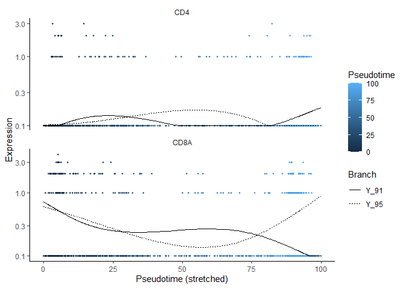

Basic Pipeline for scRNAseq Data Analysis: Trajectory Analysis
================
Somi Kim, Eunseo Paek, Donggon Cha
2021/07/06

## R Markdown

This is an R Markdown document. Markdown is a simple formatting syntax
for authoring HTML, PDF, and MS Word documents. For more details on
using R Markdown see <http://rmarkdown.rstudio.com>.

When you click the **Knit** button a document will be generated that
includes both content as well as the output of any embedded R code
chunks within the document. You can embed an R code chunk like this:

``` r
library(monocle)
library(ggplot2)
```

## Including Plots

You can also embed plots, for example:

``` r
counts <- sce_t@assays@data$logcounts

pd.df = as.data.frame(sce_t@colData)
pd <- new("AnnotatedDataFrame", data=pd.df)

fd.df = data.frame(row.names = rownames(counts),
                   gene_short_name = rownames(counts))
fd <- new("AnnotatedDataFrame", data=fd.df)

cds <- newCellDataSet(as.matrix(counts),
                      phenoData = pd,
                      featureData = fd,
                      expressionFamily = negbinomial.size())
```

``` r
cds <- setOrderingFilter(cds, hvg.t)

cds <- estimateSizeFactors(cds)
cds <- estimateDispersions(cds)
cds <- reduceDimension(cds)

cds <- orderCells(cds, reverse=TRUE)
```

``` r
plot_cell_trajectory(cds, color_by = "Pseudotime")
```

<!-- -->

``` r
plot_genes_branched_pseudotime(cds[c("CD4", "CD8A"),],
                               branch_point = 2,
                               color_by = "Pseudotime",
                               ncol = 1)
```

<!-- -->
